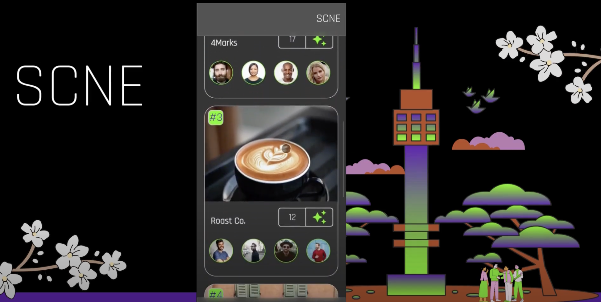

# SCNE (Social Community Networking Experience)

##  /siːn/

SCNE is a local social networking app designed to connect communities and foster engagement within specific areas. The app provides a platform for users to interact with their neighbors, local businesses, and community organizations, creating a vibrant and connected local ecosystem.

  

SCNE provides a unique experience for users to explore and participate in different scenes. Users can discover various events, people, and businesses in each scene and can interact with them through posting jobs, making connections, and attending events. Additionally, the app allows users to upvote their favorite businesses in each scene. With SCNE, users can immerse themselves in various scenes and make meaningful connections in their community.

# Development Set Up

During the legacy project, the codebase was refactored into typescript. Therefore the run commands have changed.!

Steps to start:

1: run "npm i" from the client/scne folder

2: run "npm i" from the server folder

3: open three terminals

4: "npm start" will run the front end on localhost

5: "npm run dev" will run the backend server

6: "npm run build:dev" will run the dist file which is the typescript converted into js so that it will run.

7: the db credentials in models/index will need to change to your own.

8: Running cypress tests - Cypress E2E tests are stored within 'cypress' folder.Make sure that cypress is installed on your machine. Then running npx cypress open will launch cypress GUI, allowing user to view and run tests to see whether the app is compiling as expected.

